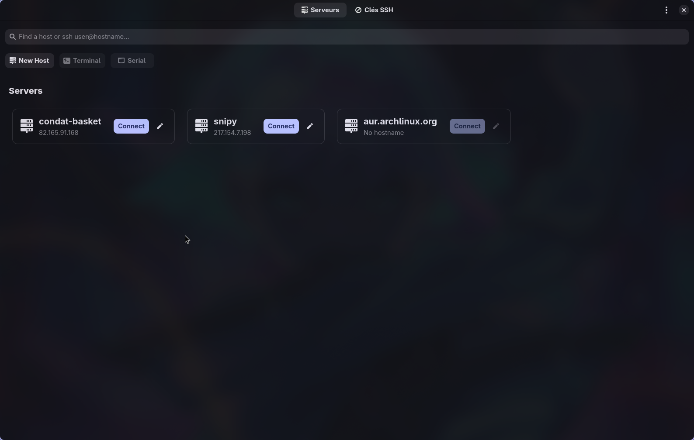

<div align="center">

  

  <h1>🔐 Rustmius</h1>

  <p>
    
    
    
    
  </p>

  

</div>

## 🎯 Purpose

**Rustmius** is a full local Termius alternative for Linux, built with Rust and GTK4/libadwaita that simplifies SSH server and key management. Say goodbye to manually editing SSH config files and managing keys through the command line!

### ✨ Key Features

- 🖥️ **Visual Server Management**: Add, edit, and organize your SSH servers with a beautiful, modern interface
- 🔑 **SSH Key Management**: Generate, view, and manage your SSH key pairs effortlessly
- 🔍 **Smart Search**: Quickly find servers and keys with intelligent filtering
- 🚀 **One-Click Connection**: Connect to servers directly from the app with automatic terminal detection
- 🎨 **Modern UI**: Built with libadwaita for a native GNOME experience
- ⚡ **Lightning Fast**: Written in Rust for optimal performance and memory safety
- 🔧 **Cross-Terminal Support**: Works with foot, gnome-terminal, konsole, alacritty, kitty, and more

## 🛠️ Development Roadmap

### 🎯 Current Version (v0.2.0)
- ✅ Basic server management (add, edit, delete)
- ✅ SSH key visualization and management
- ✅ Server connection with terminal integration
- ✅ Modern GTK4/libadwaita interface

### 🚀 Upcoming Features

#### Phase 1 - Enhanced Management (v0.3.0)
- [x] 🔄 **Server Groups & Tags**: Organize servers by project or environment (https://github.com/Cleboost/Rustmius/pull/16)
- [x] 📊 **Connection History**: Track and manage recent connections (https://github.com/Cleboost/Rustmius/pull/19)
- [x] 🔐 **Key Generation Wizard**: Guided SSH key creation with best practices (https://github.com/Cleboost/Rustmius/pull/9)
- [x] 📋 **Import/Export**: Backup and restore SSH configurations (https://github.com/Cleboost/Rustmius/pull/7 https://github.com/Cleboost/Rustmius/pull/21)

#### Phase 2 - Advanced Features (v0.4.0)
- [ ] 🌐 **Remote Config Sync**: Sync configurations across multiple machines (not sure)
- [ ] 🎨 **Custom Themes**: Dark/light mode and custom color schemes

### 🎨 UI/UX Improvements
- [ ] 🎯 **Keyboard Shortcuts**: Power-user keyboard navigation
- [ ] 📱 **Responsive Design**: Better support for different screen sizes
- [ ] 🌍 **Internationalization**: Multi-language support
- [ ] ♿ **Accessibility**: Full screen reader and keyboard navigation support

## 🚀 Installation

### From AUR (Arch Linux)
```bash
# Install from source
yay -S rustmius

# Or install pre-built binary
yay -S rustmius-bin
```

### From Source
```bash
git clone https://github.com/Cleboost/Rustmius.git
cd Rustmius
cargo build --release
```

### From Flatpak (soon)
```bash
flatpak install com.github.Cleboost.Rustmius # soon
```

## 🎮 Usage

1. **Launch the application** - It will automatically scan your `~/.ssh/config` file
2. **Add servers** - Click "New Host" to add SSH servers with a friendly interface
3. **Manage keys** - Switch to the "SSH Keys" tab to view and manage your key pairs
4. **Connect** - Click the "Connect" button on any server card to establish an SSH connection
5. **Search** - Use the search bar to quickly find specific servers or keys

## 🤝 Contributing

We welcome contributions from the community! 🎉 Whether you're fixing bugs, adding features, or improving documentation, your help makes this project better for everyone.

### 🛠️ How to Contribute

1. **Fork the repository** 🍴
2. **Create a feature branch** `git checkout -b feature/amazing-feature`
3. **Make your changes** ✨
4. **Test thoroughly** 🧪
5. **Commit with clear messages** 📝
6. **Push to your fork** 🚀
7. **Open a Pull Request** 🔄

### 🎯 Areas Where We Need Help

- 🐛 **Bug Reports**: Found a bug? Let us know!
- 💡 **Feature Requests**: Have ideas? We'd love to hear them!
- 📚 **Documentation**: Help improve our docs and guides
- 🎨 **UI/UX**: Design improvements and user experience enhancements
- 🧪 **Testing**: Help us test on different systems and configurations
- 🌍 **Translations**: Help us reach users in different languages

### 📋 Pull Request Guidelines

- **Clear descriptions**: Explain what your PR does and why
- **Small, focused changes**: Keep PRs focused on a single feature or fix
- **Test your changes**: Make sure everything works as expected
- **Follow code style**: Use `cargo fmt` and `cargo clippy`

### 🏆 Recognition

Contributors will be recognized in our README and release notes. We appreciate every contribution, no matter how small! 🙏

## 📄 License

This project is licensed under the MIT License - see the [LICENSE](LICENSE) file for details.

## 🙏 Acknowledgments

- **GTK4 & libadwaita** teams for the amazing UI framework
- **Rust community** for the excellent ecosystem
- **All contributors** who help make this project better
- **Arch Linux** community for the AUR packages

---

<div align="center">
  <p>Made with ❤️ by <a href="https://github.com/Cleboost">Cleboost</a></p>
  <p>⭐ Star this repo if you find it useful!</p>
</div>
