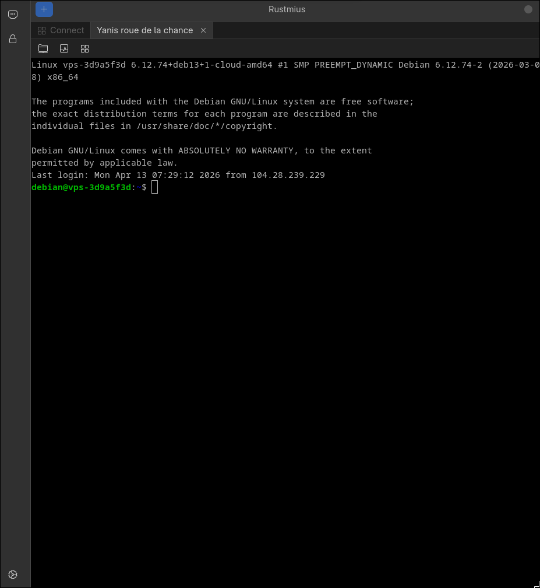

# 🦀 Rustmius

[](https://github.com/Cleboost/Rustmius/releases)
[](LICENSE)
[](https://github.com/Cleboost/Rustmius)

<p align="center">
  
</p>

**Rustmius** is a modern, fast, and local alternative to Termius, designed specifically for the Linux ecosystem. Built with Rust using GTK4, it provides a premium user experience while ensuring maximum security by keeping all your configurations stored locally.

---

## ✨ Features

- **Integrated SSH Terminal**: Powered by VTE for robust and high-performance terminal emulation.
- **Advanced SFTP Explorer**: 
    - Bidirectional Drag & Drop between your local system and remote servers.
    - Full context menu support (Rename, Delete, Download, Create Folders/Files).
    - File type icons and size formatting.
- **Host Manager**: Centralized SSH connections management with an intuitive interface.
- **Security First**: Utilizes the system keyring (via `oo7`/libsecret) to store your passwords and secrets securely.
- **Extreme Optimization**: Binaries are compiled with LTO (Link Time Optimization) and specific CPU targets for maximum responsiveness.
- **Modern UI**: Seamless integration with modern Linux environments through GTK4.

## 🚀 Installation

### Arch Linux (AUR)
The easiest way on Arch Linux is to use the `-bin` package (pre-compiled and optimized):
```bash
# Using your favorite AUR helper (e.g., yay)
yay -S rustmius-bin
```

### Other Distributions (Binaries)
Download the binary matching your hardware from the [Releases](https://github.com/Cleboost/Rustmius/releases) page:
- `rustmius-x86_64`: For standard 64-bit Linux PCs.
- `rustmius-x86_64-v3`: **Super-Optimized** version for modern CPUs (Haswell+).

### Building from Source
Ensure you have the system dependencies installed (`libgtk-4-dev`, `libvte-2.91-gtk4-dev`):
```bash
git clone https://github.com/Cleboost/Rustmius.git
cd Rustmius
cargo build --release
```

## 🗺️ Roadmap

- [ ] **Server Performance Monitoring** (Custom Rust UI, htop-like experience)
- [ ] **Docker Manager** (View images, Pull, Start/Stop/Create containers)
- [x] **SSH Keys Management** (Creation, Deletion, Auto-config on servers, Key-based auth UX)
- [ ] **SyncCloud** (Optional): Cross-device synchronization or backup using fully encrypted GitHub Gists.
- [ ] Global Settings & Themes

## 🛠️ Development

Rustmius is built upon a cutting-edge technology stack:
- **Language**: [Rust](https://www.rust-lang.org/)
- **UI**: [GTK4](https://gtk.org/)
- **SSH/SFTP**: `ssh2-rs`
- **Terminal**: `vte4`

## ⚖️ License & Intellectual Property
This software is distributed under the [GNU AGPLv3 license](LICENSE).

### Name and protection: 
- The name "Rustmius", its logo, and its visual identity are the exclusive property of the original author.
- While the source code is open, the use of the name "Rustmius" for derivative works (forks) or third-party commercial products is not permitted without prior written consent.
- If you create a modified version of this software, you must rename it clearly to avoid any confusion with the official version.

### Forking & Usage Constraints:
- Forks and derivative works are permitted and encouraged, provided they remain under the same AGPLv3 license.
- Non-Commercial Use Only: Derivative versions or forks of this project may not be used for commercial purposes or sold as proprietary software.
- All modifications must remain public and accessible to the community
---

*Developed with ❤️ by Cleboost.*
